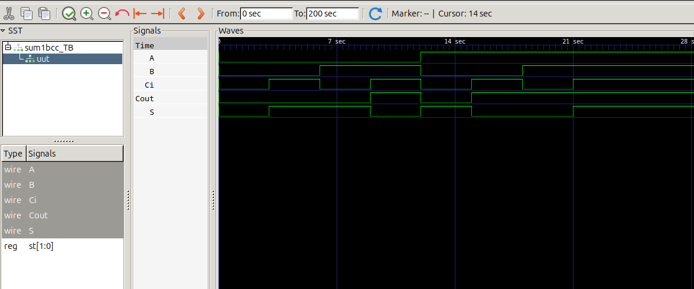

# lab01- sumador 
## nombre
Jesus Antonio Lopez Trigozo


## informe de laoratorio 

# Informe del Laboratorio: Sumador de un Bit

## Introducción

En este laboratorio se implementó un **sumador de un bit** en Verilog, con el objetivo de sumar dos bits junto con un acarreo de entrada, generando como resultado un bit de suma y un bit de acarreo de salida. Se utilizó un **testbench** para validar el correcto funcionamiento del sumador mediante simulación.

## Objetivo

El objetivo del proyecto es diseñar un sumador de un bit, con tres entradas: dos bits (`A` y `B`) y un acarreo de entrada (`Ci`), y dos salidas: la suma (`S`) y el acarreo de salida (`Cout`).

El diseño tiene como finalidad implementar la suma binaria de tres bits de manera eficiente, y verificar su correcto funcionamiento a través de una simulación con un testbench en Verilog.

## Descripción del Proyecto

### Entradas y Salidas

- **Entradas:**
  - **A**: Primer bit a sumar.
  - **B**: Segundo bit a sumar.
  - **Ci**: Acarreo de entrada.

- **Salidas:**
  - **S**: Resultado de la suma de los tres bits.
  - **Cout**: Acarreo de salida.

### Lógica del Sumador

El sumador realiza la suma binaria de los tres bits de entrada (`A + B + Ci`). La operación de suma está representada por la siguiente tabla de verdad:

| A  | B  | Ci | S  | Cout |
|----|----|----|----|------|
| 0  | 0  | 0  | 0  | 0    |
| 0  | 0  | 1  | 1  | 0    |
| 0  | 1  | 0  | 1  | 0    |
| 0  | 1  | 1  | 0  | 1    |
| 1  | 0  | 0  | 1  | 0    |
| 1  | 0  | 1  | 0  | 1    |
| 1  | 1  | 0  | 0  | 1    |
| 1  | 1  | 1  | 1  | 1    |

## Código del Proyecto

### Módulo del Sumador

El código Verilog para el módulo del sumador de un bit es el siguiente:

```verilog
module sum1bcc (A, B, Ci, Cout, S);
  input  A;
  input  B;
  input  Ci;
  output Cout;
  output S;

  reg [1:0] st;  // Registro que guarda la suma
  assign S = st[0];
  assign Cout = st[1];

  always @ ( * ) begin
    st = A + B + Ci;  // Realización de la suma
  end
endmodule

### sumador 
```

